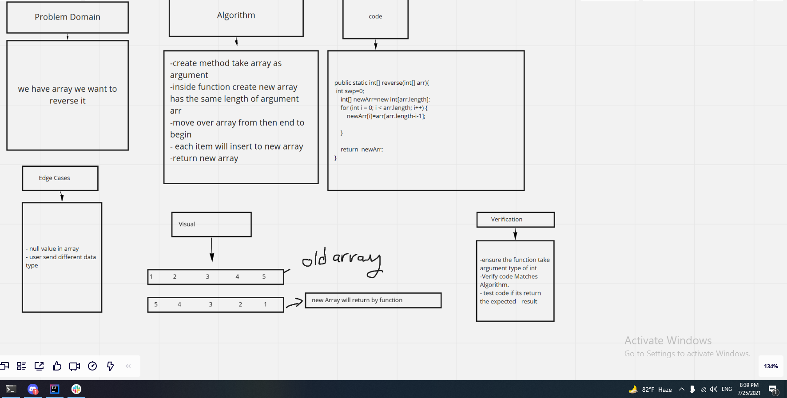

# Reverse an Array
we have array  we want to revese it  for that ,theres function  take array and revers it  

## Whiteboard Process

## Approach & Efficiency
<!-- What approach did you take? Discuss Why. What is the Big O space/time for this approach? -->