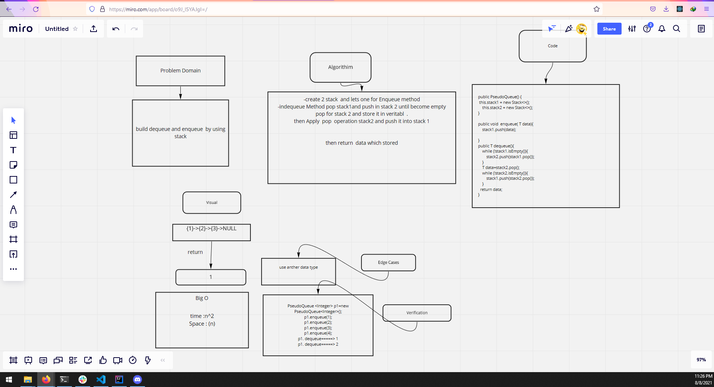

# Challenge Summary
<!-- Description of the challenge -->
build dequeue and enqueue  by using stack
## Whiteboard Process
<!-- Embedded whiteboard image -->

## Approach & Efficiency
<!-- What approach did you take? Discuss Why. What is the Big O space/time for this approach? -->
-create 2 stack  and lets one for Enqueue method
-indequeue Method pop stack1and push in stack 2 until become empty
pop for stack 2 and store it in veritabl  .
then Apply  pop  operation stack2 and push it into stack 1

then return  data which stored
