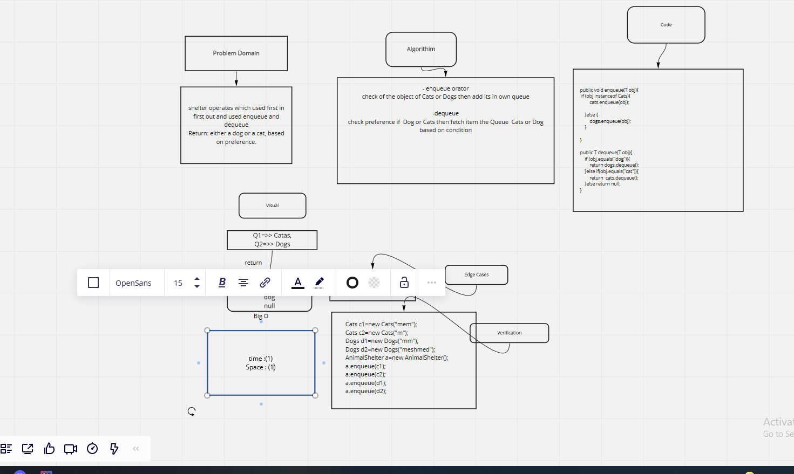

# Challenge Summary
<!-- Description of the challenge -->
shelter operates which used first in first out and used enqueue and dequeue
Return: either a dog or a cat, based on preference.
## Whiteboard Process
<!-- Embedded whiteboard image -->

## Approach & Efficiency
<!-- What approach did you take? Why? What is the Big O space/time for this approach? -->
- enqueue orator
check of the object of Cats or Dogs then add its in own queue

-dequeue
check preference if  Dog or Cats then fetch item the Queue  Cats or Dog based on condition

## Solution
<!-- Show how to run your code, and examples of it in action -->

Cats c1=new Cats("mem");
Cats c2=new Cats("m");
Dogs d1=new Dogs("mm");
Dogs d2=new Dogs("meshmed");
AnimalShelter a=new AnimalShelter();
a.enqueue(c1);
a.enqueue(c2);
a.enqueue(d1);
a.enqueue(d2);