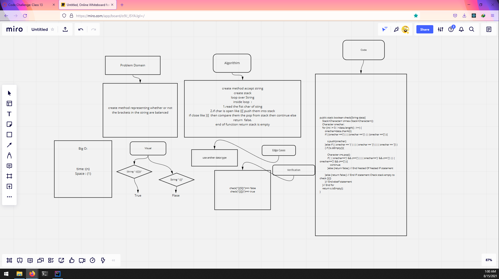

# validate brackets
<!-- Description of the challenge -->
create method representing whether or not the brackets in the string are balanced
## Whiteboard Process
<!-- Embedded whiteboard image -->

## Approach & Efficiency
<!-- What approach did you take? Why? What is the Big O space/time for this approach? -->
create method accept string
create stack
loop over String
inside loop  :
1.read the fist char of sting
2.if char is open like {([ push them into stack
if close like })]  then compare them the pop from stack then continue else return  false.
end of function return stack is empty
time :(n)
Space : (1)
## Solution
<!-- Show how to run your code, and examples of it in action -->
public static boolean check(String data){
    Stack<Character> s=new Stack<Character>();
    Character onechar;
    for (int i = 0; i <data.length() ; i++) {
        onechar=data.charAt(i);
        if ( (onechar =='(') || (onechar =='{') || (onechar =='[') ){

            s.push(onechar);
        }else if ( ( onechar == ')' ) || ( onechar == '}') || ( onechar == ']') )
        { if (!s.isEmpty()){

            Character c=s.pop();
            if (  ( onechar==')' && c=='(') || ( onechar=='}' && c=='{') || ( onechar==']' && c=='[') ){
                continue;
            }else {return false;} // End Nested Of Nested IF statement

        }else {return false;} // End IF statement Check stack empty to  check {}()}
        }// End elseIf statement
    }// End for
    return s.isEmpty();
}

 System.out.println(check("{}[5]}"));