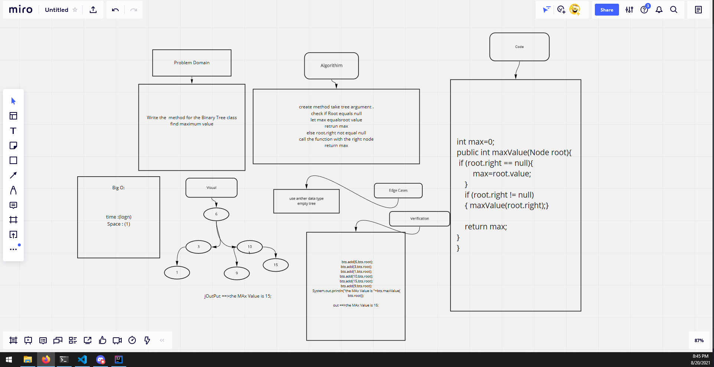

## Max value
<!-- Description of the challenge -->
Write the  method for the Binary Tree class
find maximum value

## Whiteboard Process
<!-- Embedded whiteboard image -->

## Approach & Efficiency
<!-- What approach did you take? Why? What is the Big O space/time for this approach? -->
create method take tree argument .
check if Root equals null
let max equalsroot value
retrun max
else root.right not equal null
call the function with the right node
return max

time :(logn)

Space : (1)

int max=0;
public int maxValue(Node root){
 if (root.right == null){
        max=root.value;
    }
    if (root.right != null)
    { maxValue(root.right);}

    return max;
}
}