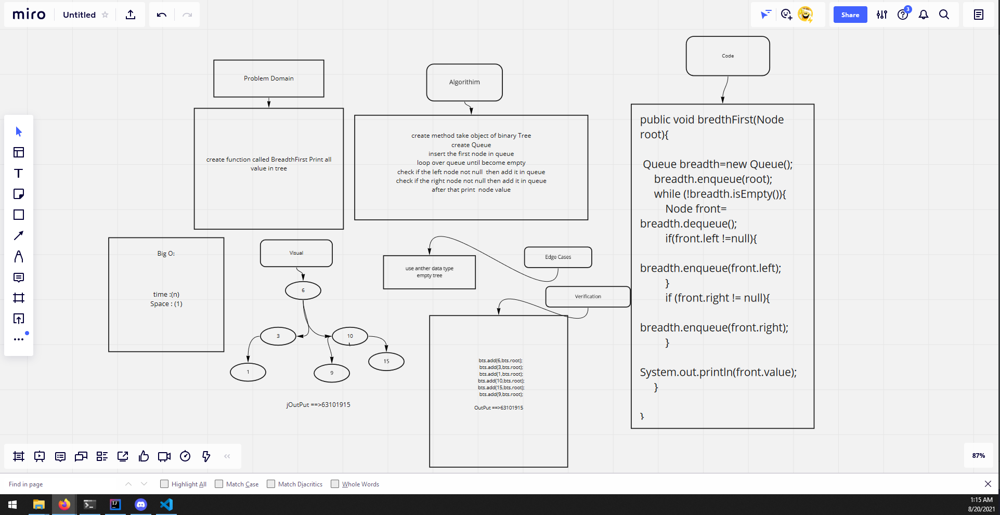

# tree fizz buzz
<!-- Description of the challenge -->
create function called BreadthFirst Print all value in tree

## Whiteboard Process
<!-- Embedded whiteboard image -->

## Approach & Efficiency
<!-- What approach did you take? Why? What is the Big O space/time for this approach? -->
Breadth First 

create method take object of binary Tree
create Queue
insert the first node in queue
loop over queue until become empty
check if the left node not null  then add it in queue
check if the right node not null then add it in queue
after that print  node value
time : (n)
sapce : (1)
## Solution
<!-- Show how to run your code, and examples of it in action -->
public void bredthFirst(Node root){

 Queue breadth=new Queue();
     breadth.enqueue(root);
     while (!breadth.isEmpty()){
         Node front= breadth.dequeue();
         if(front.left !=null){
             breadth.enqueue(front.left);
         }
         if (front.right != null){
             breadth.enqueue(front.right);
         }
         System.out.println(front.value);
     }