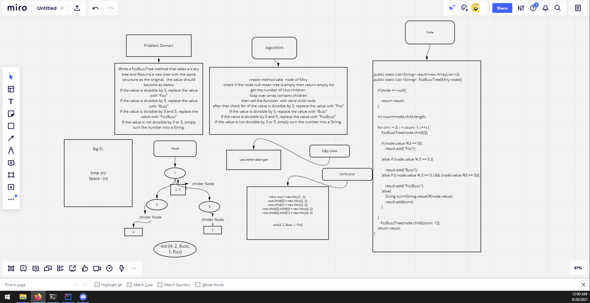

# tree fizz buzz
<!-- Description of the challenge -->
Write a fizzBuzzTree method that takes a k-ary tree and Returns a new tree with the same structure as the original,  the value should become as below
If the value is divisible by 3, replace the value with “Fizz”
If the value is divisible by 5, replace the value with “Buzz”
If the value is divisible by 3 and 5, replace the value with “FizzBuzz”
If the value is not divisible by 3 or 5, simply turn the number into a String.

## Whiteboard Process
<!-- Embedded whiteboard image -->

## Approach & Efficiency
<!-- What approach did you take? Why? What is the Big O space/time for this approach? -->
K-ary Tree 

create method take  node of KAry
-check if the node null mean tree is empty then return empty list
get the number of root children.
loop over array contains children
then call the function  with send child node
after that check for :If the value is divisible by 3, replace the value with “Fizz”
If the value is divisible by 5, replace the value with “Buzz”
If the value is divisible by 3 and 5, replace the value with “FizzBuzz”
If the value is not divisible by 3 or 5, simply turn the number into a String.
## Solution
<!-- Show how to run your code, and examples of it in action -->
public static List<String> result=new ArrayList<>();
public static List <String>  fizzBuzzTree(KAry node){

    if (node == null){

        return result;
    }

    int count=node.child.length;

    for (int i = 0; i < count -1; i++) {
        fizzBuzzTree(node.child[i]);

        if (node.value %3 == 0){
            result.add("Fizz");

        }else if (node.value % 5 == 0 ){

            result.add("Buzz");
        }else if (( node.value % 3 == 0 ) && (node.value %5 == 0)){

            result.add("FizzBuzz");
        }else{
            String turn=String.valueOf(node.value);
            result.add(turn);
        }

    }
       fizzBuzzTree(node.child[count -1]);
    return result;
}