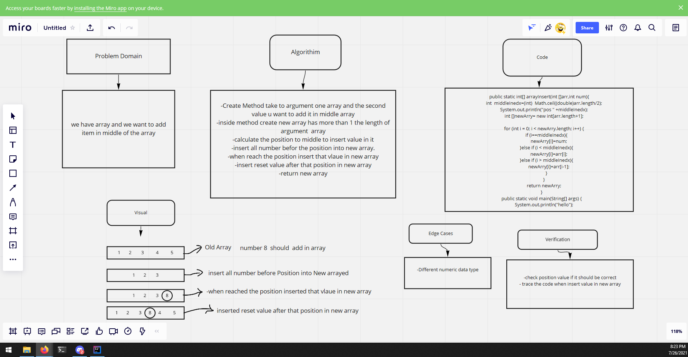

# Insert to Middle of an Array

- we have array and we want to add item in middle of the array

## Whiteboard Process
<!-- Embedded whiteboard image -->

 

## Approach & Efficiency
<!-- What approach did you take? Discuss Why. What is the Big O space/time for this approach? -->

- I create new Array  in method have one more than old array length then calculate the position  to insert value inside it  then insert all number befor in  postion in new array  then insert new Value in that position and then insert the reset value  in new array.
