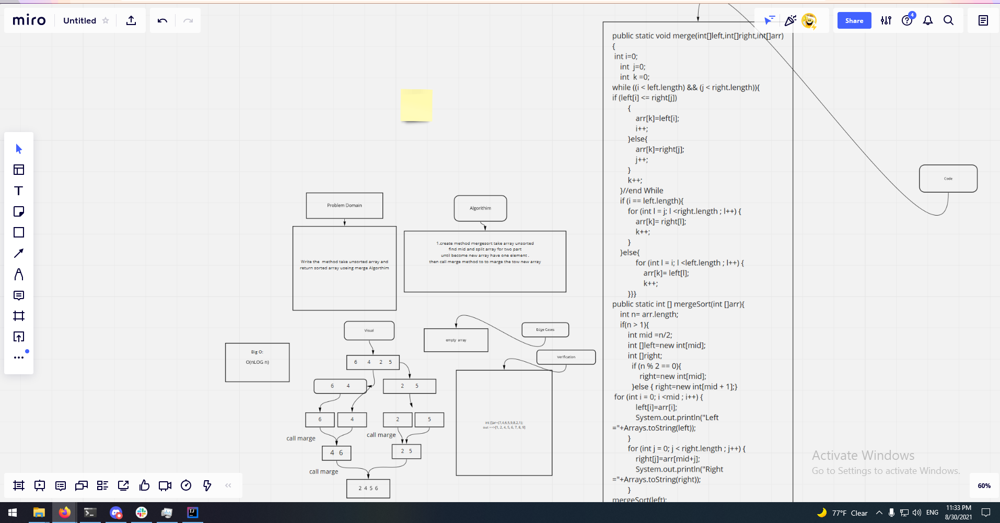

# Merge sort
<!-- Description of the challenge -->

Write the  method take unsorted array and return sorted array useing merge Algorthim

## Whiteboard Process
<!-- Embedded whiteboard image -->

## Approach & Efficiency
<!-- What approach did you take? Why? What is the Big O space/time for this approach? -->
1.create method mergesort take array unsorted
find mid and split array for two part
until become new array have one element .
then call merge method to to marge the tow new array

O(nLog n)
## Solution
<!-- Show how to run your code, and examples of it in action -->
public static void merge(int[]left,int[]right,int[]arr){
 int i=0;
    int  j=0;
    int  k =0;
while ((i < left.length) && (j < right.length)){
if (left[i] <= right[j])
        {
            arr[k]=left[i];
            i++;
        }else{
            arr[k]=right[j];
            j++;
        }
        k++;
    }//end While
    if (i == left.length){
        for (int l = j; l <right.length ; l++) {
            arr[k]= right[l];
            k++;
        }
    }else{
            for (int l = i; l < left.length ; l++) {
                arr[k]= left[l];
                k++;
        }}}
public static int [] mergeSort(int []arr){
    int n= arr.length;
    if(n > 1){
        int mid =n/2;
        int []left=new int[mid];
        int []right;
          if (n % 2 == 0){
              right=new int[mid];
          }else { right=new int[mid + 1];}
 for (int i = 0; i <mid ; i++) {
            left[i]=arr[i];
            
        }
        for (int j = 0; j < right.length ; j++) {
            right[j]=arr[mid+j];
         
        }
mergeSort(left);
        mergeSort(right);
        merge(left,right,arr);
    }//end IF N > 1
 return arr;
}