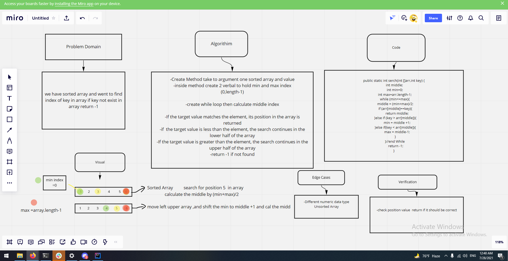

# Binary Search of Sorted Array
<!-- Description of the challenge -->
we have sorted array and went to find index of key in array if key not exist in array return -1
## Whiteboard Process
<!-- Embedded whiteboard image -->

## Approach & Efficiency
<!-- What approach did you take? Discuss Why. What is the Big O space/time for this approach? -->
Binary search begins by comparing an element in the middle of the array with the target value. If the target value matches the element, its position in the array is returned. If the target value is less than the element, the search continues in the lower half of the array. If the target value is greater than the element, the search continues in the upper half of the array. By doing this, the algorithm eliminates the half in which the target value cannot lie in each iteration