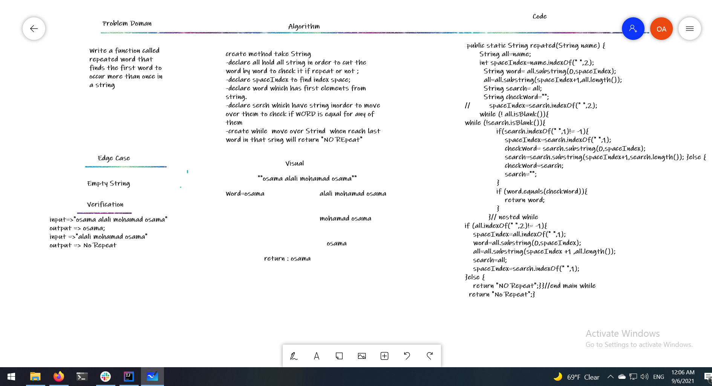

# Repeat Word
<!-- Description of the challenge -->
Write a function called repeated word that finds the first word to occur more than once in a string
## Whiteboard Process
<!-- Embedded whiteboard image -->

## Approach & Efficiency
<!-- What approach did you take? Why? What is the Big O space/time for this approach? -->

create method take String
-declare all hold all string in order to cut the word by word to check it if repeat or not ;
-declare spaceIndex to find index space;
-declare word which has first elements from string.
-declare serch which have string inorder to move over them to check if WORD is equal for any of them 
-create while  move over Strind  when reach last word in that sring will return "NO REpeat"

O(Nlogn)
## Solution
<!-- Show how to run your code, and examples of it in action -->
public static String repated(String name) {
       String all=name;
       int spaceIndex=name.indexOf(" ",2);
         String word= all.substring(0,spaceIndex);
         all=all.substring(spaceIndex+1,all.length());
         String search= all;
         String checkWord="";
//         spaceIndex=search.indexOf(" ",2);
       while (! all.isBlank()){
while (!search.isBlank()){
               if(search.indexOf(" ",1)!= -1){
                   spaceIndex=search.indexOf(" ",1);
                   checkWord= search.substring(0,spaceIndex);
                   search=search.substring(spaceIndex+1,search.length()); }else {
                   checkWord=search;
                   search="";
               }
               if (word.equals(checkWord)){
                   return word;
               }
           }// nested while
if (all.indexOf(" ",2)!= -1){
    spaceIndex=all.indexOf(" ",1);
    word=all.substring(0,spaceIndex);
    all=all.substring(spaceIndex +1 ,all.length());
    search=all;
    spaceIndex=search.indexOf(" ",1);
}else {
    return "NO Repeat";}}//end main while
  return "No Repeat";}