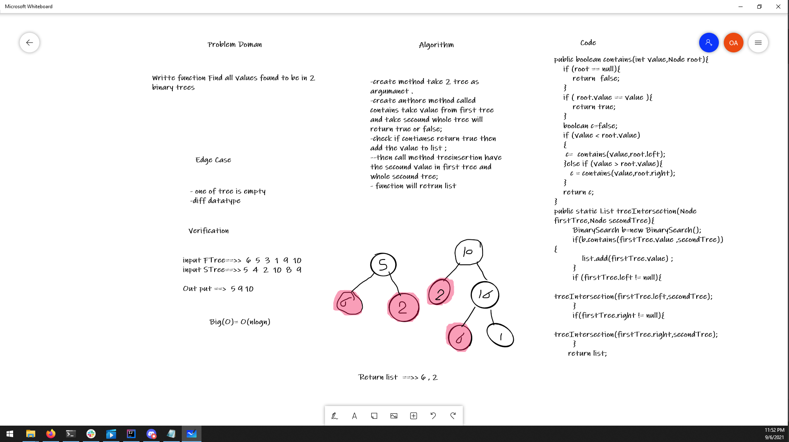

# Repeat Word
<!-- Description of the challenge -->
Writte function Find all values found to be in 2 binary trees
## Whiteboard Process
<!-- Embedded whiteboard image -->

## Approach & Efficiency
<!-- What approach did you take? Why? What is the Big O space/time for this approach? -->

create method take 2 tree as argumanet .
-create anthore method called contains take value from first tree and take secound whole tree will return true or false;
-check if contianse return true then add the value to list ;
--then call method treeinsertion have the secound value in first tree and whole secound tree;
- function will retrun list 

O(Nlogn) its like 2 nested for loop
## Solution
<!-- Show how to run your code, and examples of it in action -->
public boolean contains(int value,Node root){
    if (root == null){
        return  false;
    }
    if ( root.value == value ){
        return true;
    }
    boolean c=false;
    if (value < root.value)
    {
     c=  contains(value,root.left);
    }else if (value > root.value){
       c = contains(value,root.right);
    }
    return c;
}
public static List treeIntersection(Node firstTree,Node secondTree){
        BinarySearch b=new BinarySearch();
        if(b.contains(firstTree.value ,secondTree)){
            list.add(firstTree.value) ;
        }
        if (firstTree.left != null){
            treeIntersection(firstTree.left,secondTree);
        }
        if(firstTree.right != null){
            treeIntersection(firstTree.right,secondTree);
        }
      return list;