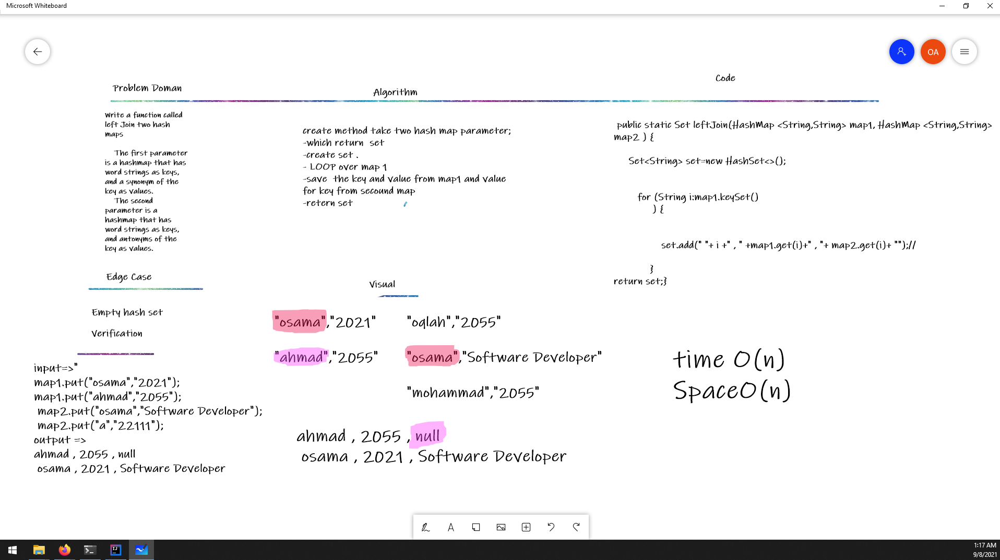

# Left Join
<!-- Description of the challenge -->
Write a function called left Join two hash maps

 The first parameter is a hashmap that has word strings as keys, and a synonym of the key as values.
 The second parameter is a hashmap that has word strings as keys, and antonyms of the key as values.
## Whiteboard Process
<!-- Embedded whiteboard image -->

## Approach & Efficiency
<!-- What approach did you take? Why? What is the Big O space/time for this approach? -->

create method take two hash map parameter;
-which return  set
-create set .
- LOOP over map 1 
-save  the key and value from map1 and value for key from secound map
-retern set

time O(n)
SpaceO(n)
## Solution
<!-- Show how to run your code, and examples of it in action -->
 public static Set leftJoin(HashMap <String,String> map1, HashMap <String,String> map2 ) {

     Set<String> set=new HashSet<>();

        for (String i:map1.keySet()
             ) {

                set.add(" "+ i +" , " +map1.get(i)+" , "+ map2.get(i)+ "");//          

            }
return set;}