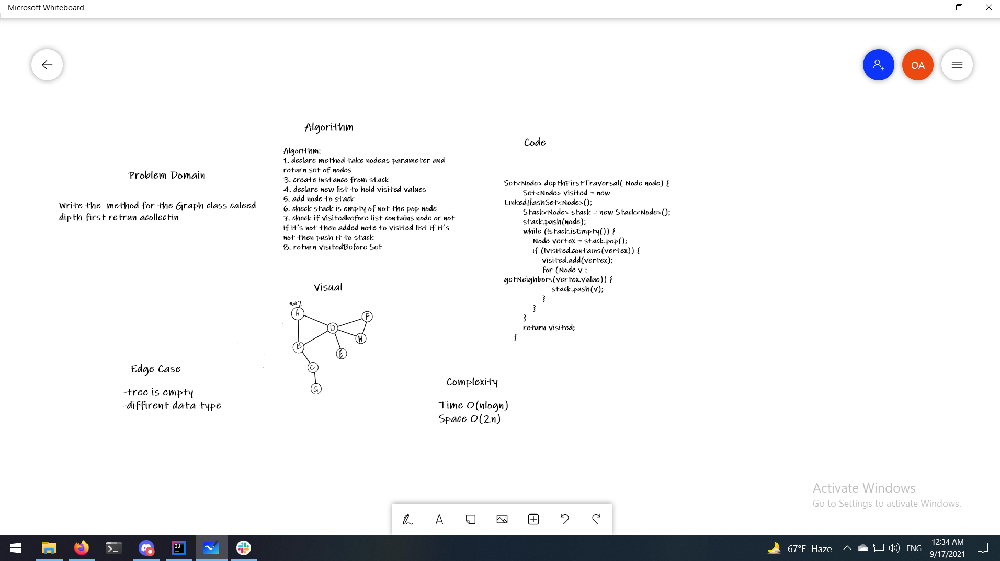

# Dipth
<!-- Description of the challenge -->

    depth first
    Arguments: Node (Starting point of search)
    Return: A collection of nodes in their pre-order depth-first traversal order
    Display the collection

## Approach & Efficiency
<!-- What approach did you take? Why? What is the Big O space/time for this approach? -->

time O(n)
SpaceO(2n)
## API
<!-- Show how to run your code, and examples of it in action -->
Set<Node> depthFirstTraversal( Node node) {
        Set<Node> visited = new LinkedHashSet<Node>();
        Stack<Node> stack = new Stack<Node>();
        stack.push(node);
        while (!stack.isEmpty()) {
            Node vertex = stack.pop();
            if (!visited.contains(vertex)) {
                visited.add(vertex);
                for (Node v : getNeighbors(vertex.value)) {
                    stack.push(v);
                }
            }
        }
        return visited;
    }