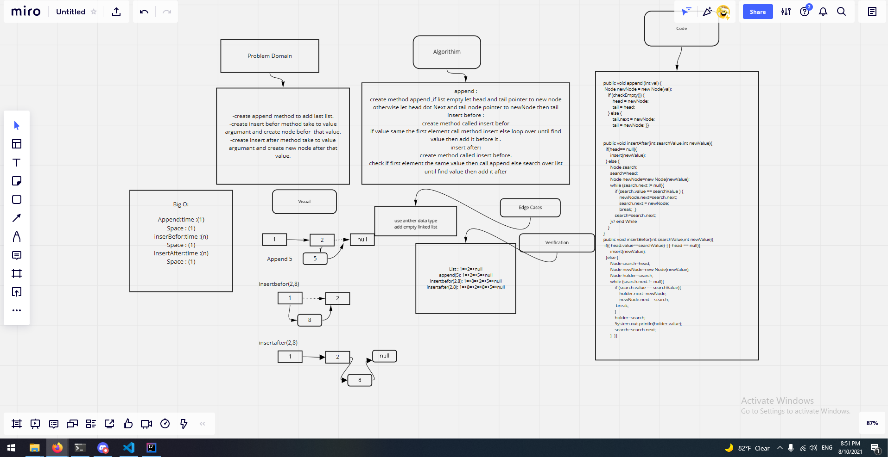

 append

 adds a new node with the given value to the end of the list

 insert before

   adds a new node with the given new value immediately before the first node
    that has the value specified
 
 insert after

adds a new node with the given new value immediately after the first node that has the value specified

