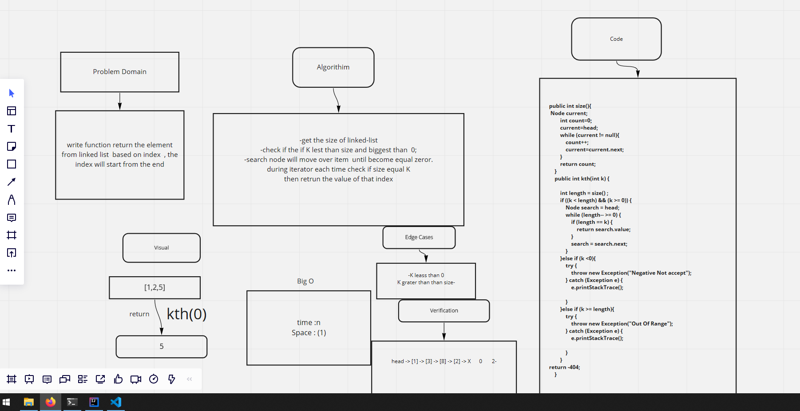

# Challenge Summary
<!-- Description of the challenge -->
write function return the element from linked list  based on index  , the index will start from the end
## Whiteboard Process
<!-- Embedded whiteboard image -->

## Approach & Efficiency
<!-- What approach did you take? Why? What is the Big O space/time for this approach? -->
-get the size of linked-list
-check if the if K lest than size and biggest than  0;
-search node will move over item  until become equal zero.
during iterator each time check if size equal K
then return the value of that index

## Solution
<!-- Show how to run your code, and examples of it in action -->

LinkedList l1=new LinkedList();
        l1.append(1);
        l1.append(2);
        l1.append(3);
        l1.append(4);
        l1.append(8);
        l1.print();
        System.out.println(l1.size());
        System.out.println(l1.toString());
        System.out.println("KTH "+l1.kth(2));

    - return 3