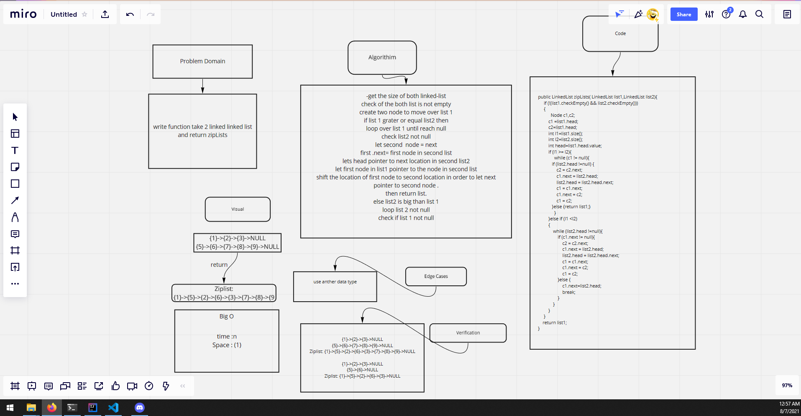

# Challenge Summary
<!-- Description of the challenge -->
write function take 2 linked linked list and return zipLists
## Whiteboard Process
<!-- Embedded whiteboard image -->

## Approach & Efficiency
<!-- What approach did you take? Why? What is the Big O space/time for this approach? -->
-get the size of both linked-list
check of the both list is not empty
create two node to move over list 1
if list 1 grater or equal list2 then
loop over list 1 until reach null
check list2 not null
let second  node = next
first .next= first node in second list
lets head pointer to next location in second list2
let first node in list1 pointer to the node in second list
shift the location of first node to second location in order to let next pointer to second node .
then return list.
else list2 is big than list 1
loop list 2 not null
check if list 1 not null

