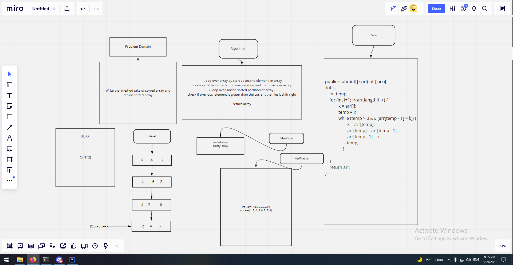
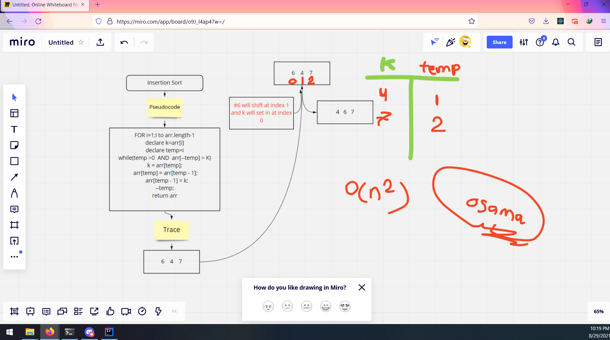

# Insertion sort
<!-- Description of the challenge -->

Write the  method take unsorted array and return sorted array
## Whiteboard Process
<!-- Embedded whiteboard image -->

## Approach & Efficiency
<!-- What approach did you take? Why? What is the Big O space/time for this approach? -->
1.loop over array by start at second element  in array
create variable in oreder for swap,and second  to move over array.
2.loop over sorted sorted partition of array .
check if previous  element is grater than the current then let it shift right

return array

O(N^2)
## Solution
<!-- Show how to run your code, and examples of it in action -->
public static int[] sort(int []arr){
 int k;
    int temp;
    for (int i=1; i< arr.length;i++) {
            k = arr[i];
            temp = i;
            while (temp > 0 && (arr[temp - 1] > k)) {
                    k = arr[temp];
                    arr[temp] = arr[temp - 1];
                    arr[temp - 1] = k;
                 --temp;
                }

    }
    return arr;
}

## BLOG 

